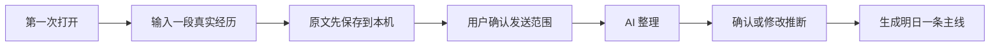
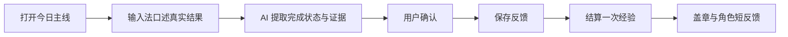
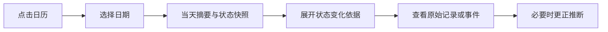
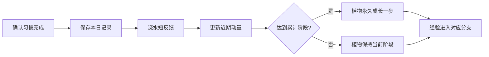

# 栖光：低保真线框与交互流程

> 文档版本：线框基线 v1.0  
> 当前阶段：最终反馈已整合；等待用户明确发出开始开发指令  
> 开发状态：正式开发尚未开始  
> 历史线框参考；现行产品逻辑以仓库根目录 `TODO.md` 为准。
> 设计约束请以同目录的像素场景规范和当前实现为准。
> 本文职责：验证七个核心页面的信息层级、入口与闭环，不决定最终像素素材和技术实现

---

## 0. 本轮需要验证的结论

1. 首页使用“房间在上、今日行动在下、记录入口固定”的纵向结构。
2. 底部保留五个入口：今日、日历、记录、成长、系统。
3. 复盘作为时间线中的章节，不额外占用底部导航。
4. 房间家具和直接导航通向相同页面；游戏交互是捷径，不是门槛。
5. 首版七个核心页面即可覆盖记录、整理、任务反馈、历史、成长、复盘和设置。
6. 所有页面只设置一个主要操作，避免普通日记、任务和游戏元素争夺注意力。

---

## 1. 全局页面框架

```text
┌────────────────────────────┐
│ 当前页面标题        状态/设置 │  顶栏
├────────────────────────────┤
│                            │
│      当前页面主要内容        │  可自然向下滚动
│                            │
├────────────────────────────┤
│ 今日  日历   ＋记录  成长  系统│  固定导航概念
└────────────────────────────┘
```

规则：

- “记录”位于导航中央，是任意页面一步可达的主要入口。
- 顶栏只保留日期、页面名称、当前主线所属分支等级或必要设置。
- 页面内主操作固定在内容自然阅读顺序中，不额外增加悬浮按钮。
- 使用房间家具进入页面时，可以播放短动画；使用底部导航时直接打开。
- 返回页面时恢复原来的日期、滚动位置和未提交输入。

---

## 2. P01 今日首页

### 2.1 目的

五秒内看懂状态、主线和记录入口。

### 2.2 线框

```text
┌────────────────────────────┐
│ 8月14日 · 今天    写作 Lv.12 │
├────────────────────────────┤
│ ┌────── 固定像素房间 ──────┐ │
│ │ 日记桌      日历          │ │
│ │    任务板  ●生活分身      │ │
│ │ 花盆×3     书架   窗边     │ │
│ └────────────────────────┘ │
│ 「今天先守住一点体力。」      │
├────────────────────────────┤
│ MAIN 01                     │
│ 写 20 分钟产品思路            │
│ 最小动作：先写三个问题 · 10m   │
│ 困难 · 20 XP        [去反馈]  │
├────────────────────────────┤
│ BONUS 2/3      支线 0/2 [展开]│
├────────────────────────────┤
│ 今日  日历   ＋记录  成长  系统│
└────────────────────────────┘
```

### 2.3 主要交互

- 点击生活分身：显示一句观察和“讲讲今天 / 为什么是这个主线 / 看本周”三个入口。
- 点击家具：角色短移动后打开对应页面。
- 点击“去反馈”：进入当前主线反馈，不先打开完整任务管理页。
- 点击习惯摘要：原位展开三个习惯，避免跳转打断。
- 点击支线摘要：展示最多两条支线。

### 2.4 页面状态

- 初次使用：房间保留，主线区域替换为“先讲讲最近发生的一件事”。
- 今日无主线：显示“暂时不安排主线”，记录入口保持突出。
- 低状态：主线可以是休息或减负；房间不破败、不变暗到难以阅读。
- 离线：显示本地可用状态，记录与本地任务继续工作。

---

## 3. P02 记录与整理

### 3.1 目的

让用户像发消息一样留下真实经历，并控制 AI 推断。

### 3.2 线框

```text
┌────────────────────────────┐
│ 记录今天                 关闭 │
├────────────────────────────┤
│ 日期 [2026-08-14]           │
│ ┌────────────────────────┐ │
│ │ 今天开了很多会，下午很累。 │ │
│ │ 晚饭后散步十五分钟，好一些。│ │
│ │                        │ │
│ └────────────────────────┘ │
│ 可直接使用系统输入法口述       │
│                            │
│ 将发送：本段文字 + 今日上下文   │
│ [查看/删减上下文]             │
│                            │
│ [仅保存原文]  [保存并自动整理]  │
├────────────────────────────┤
│ 今日  日历   ＋记录  成长  系统│
└────────────────────────────┘
```

### 3.3 整理结果顺序

1. 今日标题和一句摘要。
2. 最多六个事件及原文证据。
3. 用户明确表达的心情。
4. AI 推测的状态影响，默认待确认。
5. 可能的成长证据。
6. 当日复盘和明日主线建议。

主要操作是“确认本次整理”。每条 AI 推断都能单独修改或否认。

### 3.4 页面状态

- 整理中：先显示“原文已保存在本机”，允许离开。
- 整理失败：保留原文，提供稍后整理，不要求重新输入。
- 仅本地保存：不显示为错误，允许未来主动整理。
- 补记过去：记录归入选择日期，不擅自改变今天的主线。

---

## 4. P03 某日回顾

### 4.1 目的

回到某一天，理解发生了什么、状态为何变化以及后来留下了什么。

### 4.2 线框

```text
┌────────────────────────────┐
│ ‹  8月13日 周四          日历 │
├────────────────────────────┤
│ [当天房间静态快照]           │
│ “会议很多，但散步帮助恢复。”  │
├────────────────────────────┤
│ 状态：体力 38  心力 52        │
│      连接 60  推进 55  玩心 43│
│ [查看变化依据]                │
├────────────────────────────┤
│ 事件 01  连续开会             │
│ 事件 02  晚饭后散步           │
│ 原始记录 · 任务反馈 · 经验 +5  │
├────────────────────────────┤
│ [上一天]              [下一天]│
├────────────────────────────┤
│ 今日  日历   ＋记录  成长  系统│
└────────────────────────────┘
```

### 4.3 主要交互

- 点击日期打开月历；有记录和有复盘使用不同标记并配文字说明。
- 点击状态值展开证据和用户校准记录。
- 点击事件打开原文证据、AI 推断状态和经验归属。
- 空白日期提供“补记这一天”，不显示断签或失败。

---

## 5. P04 任务板

### 5.1 目的

看清“目标 → 里程碑 → 今日行动”和独立习惯之间的关系。

### 5.2 线框

```text
┌────────────────────────────┐
│ 任务板                调整重点│
├────────────────────────────┤
│ MAIN GOAL                   │
│ 完成栖光产品原型              │
│ 里程碑 2/4 · 当前：确认交互逻辑 │
│ [查看目标路径]                │
├────────────────────────────┤
│ TODAY                       │
│ 写 20 分钟产品思路             │
│ 最小动作：先写三个问题          │
│ [完成] [做了一部分] [今天不做]  │
│ [输入或口述真实结果……]         │
├────────────────────────────┤
│ BONUS   花盆1  花盆2  花盆3     │
│          2/3    3/3    1/3    │
├────────────────────────────┤
│ SIDE 01 · SIDE 02            │
├────────────────────────────┤
│ 今日  日历   ＋记录  成长  系统│
└────────────────────────────┘
```

### 5.3 主要交互

- 任务反馈允许直接点击，也允许输入法口述真实结果。
- “今天不做”结束本日提醒，并可选原因；不扣分。
- 用户可以主动创建或选择习惯并设为 BONUS；AI 只能推荐候选。
- 修改目标、里程碑或习惯需要用户明确确认。
- AI 可以建议降低难度或替代动作，但不自动改变长期目标。

---

## 6. P05 成长

### 6.1 目的

解释长期积累和每笔经验的来源，不制造人生总战力。

### 6.2 线框

```text
┌────────────────────────────┐
│ 成长                    账本 │
├────────────────────────────┤
│ 当前主线分支                 │
│ 写作判断  Lv.12              │
│ ███████░░░  72/100 XP       │
│ 最近证据：完成交互规范 v1.0    │
├────────────────────────────┤
│ 六类长期资产                 │
│ 健康   判断力   特定知识       │
│ 信任   创造杠杆  自主权        │
├────────────────────────────┤
│ 最近经验                     │
│ +20  困难任务 · 写产品思路     │
│ +5   轻量习惯 · 饭后散步       │
│ 每一笔均可查看来源与撤销记录    │
├────────────────────────────┤
│ 今日  日历   ＋记录  成长  系统│
└────────────────────────────┘
```

### 6.3 主要交互

- 默认打开主线所属分支，不要求用户先选择六类资产。
- 点击资产进入自定义分支，显示等级、里程碑和证据。
- 点击经验记录返回对应任务、习惯或事件。
- 一次跨多级只展示一次结果，不播放连续升级动画。

---

## 7. P06 周期复盘

### 7.1 目的

把一周真实证据整理成下一周期的一个重点和一个最小实验。

### 7.2 线框

```text
┌────────────────────────────┐
│ 第 33 周章节报告          稍后看│
├────────────────────────────┤
│ 这一周                      │
│ 记录 5 天 · 完成主线 3 次     │
│ 状态：体力下降，推进基本稳定    │
│ [查看证据时间线]              │
├────────────────────────────┤
│ 有效：晚饭后散步更容易完成      │
│ 消耗：会议密集日晚间任务过重    │
├────────────────────────────┤
│ 下周唯一重点                  │
│ 保护会议日的晚间恢复            │
│ 最小实验：会议日取消困难支线     │
│ [修改]             [确认采用] │
├────────────────────────────┤
│ 系统候选：会议日需要降低难度     │
│ [忘记] [编辑] [加入我的系统]    │
└────────────────────────────┘
```

复盘入口来自日历时间线、首页到期卡片和点击生活分身。关闭或稍后查看不会影响已有数据。

---

## 8. P07 我的系统

### 8.1 目的

查看和修改产品如何理解用户，以及数据和 AI 的权限边界。

### 8.2 线框

```text
┌────────────────────────────┐
│ 我的系统                    │
├────────────────────────────┤
│ 当前章节                     │
│ 全面观察，重点建设健康与创造   │
│ [编辑]                       │
├────────────────────────────┤
│ 关注领域                     │
│ 健康·重点建设  工作·维持       │
│ 创造·重点建设  关系·维持       │
│ [管理领域]                   │
├────────────────────────────┤
│ 已确认规则与记忆              │
│ 偏好 4 · 约束 2 · 原则 3       │
│ [查看与修改]                 │
├────────────────────────────┤
│ AI 权限   头像选择   数据设置   │
│ 导出数据                 删除 │
├────────────────────────────┤
│ 今日  日历   ＋记录  成长  系统│
└────────────────────────────┘
```

删除数据、撤销 AI 权限和覆盖导入等高风险操作使用普通严肃界面，不加入角色动画。

---

## 9. 五条关键流程

### 9.1 第一次记录



### 9.2 任务口述反馈



### 9.3 回看某一天



### 9.4 BONUS 与花盆



### 9.5 周复盘更新个人系统


---

## 10. 共用组件优先级

首轮原型只需要以下共用结构：

1. 顶栏。
2. 底部五入口导航。
3. 像素房间占位区和家具热点。
4. 生活分身与一句话气泡。
5. 主线任务面板。
6. 普通信息面板。
7. AI 推断状态行。
8. 任务反馈输入区。
9. 习惯花盆与近期动量。
10. 经验来源行。
11. 确认、修改、否认和撤销操作。

不提前抽象更多组件；视觉稿出现真实重复后再统一。

---

## 11. 线框验收标准

- 七个页面都有明确且唯一的主要操作。
- 任意页面可以一步进入记录。
- 首页首屏同时看见房间、主线和记录入口。
- 不点击房间也能完成所有核心流程。
- 任务反馈不超过一次页面跳转。
- 某日回顾能够追溯状态、事件和经验证据。
- AI 推断与用户确认在视觉和文字上明确区分。
- 习惯中断不出现枯萎、断签或负分。
- 周复盘只形成一个下周重点和一个最小实验。
- 字体放大、减少动态和离线状态下仍能完成记录闭环。

---

## 12. 本阶段不做

- 不制作正式像素素材和角色 Sprite Sheet。
- 不决定前端框架、渲染引擎和 AI 厂商。
- 不连接真实模型、账户、同步和通知。
- 不制作全部角色外观和房间成长物件。
- 不把线框写成可运行产品代码。
- 不根据当前仓库中的草稿实现反向修改设计。

---

## 13. 审查方式

本轮只需判断：

1. 七个页面是否覆盖真实使用闭环。
2. 首页布局是否符合“电子宠物般的陪伴感 + 工具效率”。
3. 复盘放在时间线而不是底部导航是否合理。
4. 各页面的主要操作是否清楚。
5. 是否有任何页面仍然像普通待办仪表盘。

审查结果可以写成：

```text
线框整体通过

或

第 P0X 页需要修改：……
```
